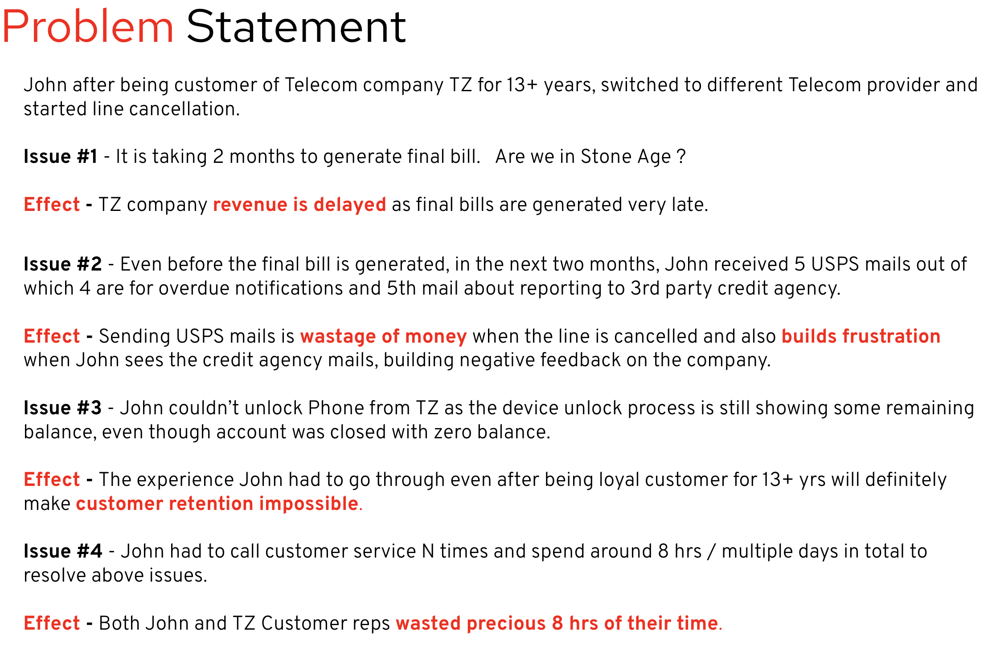
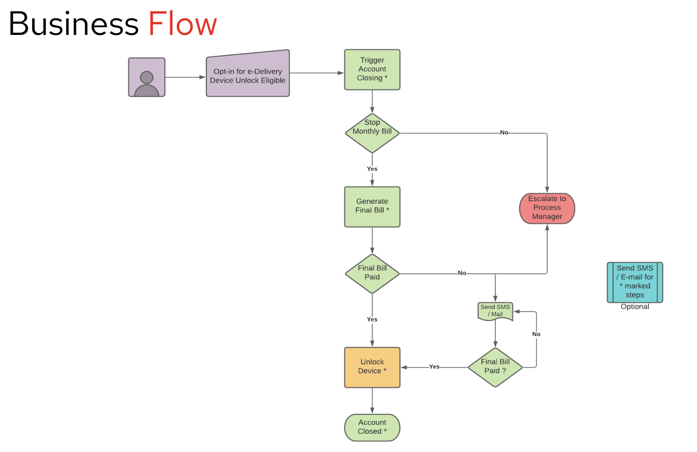
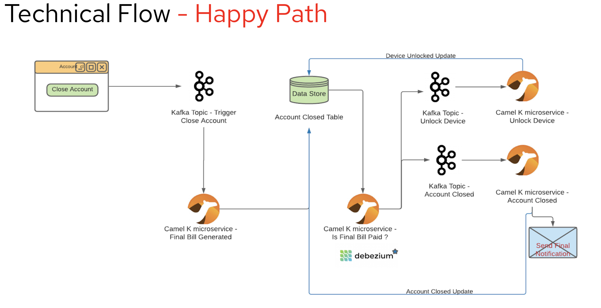
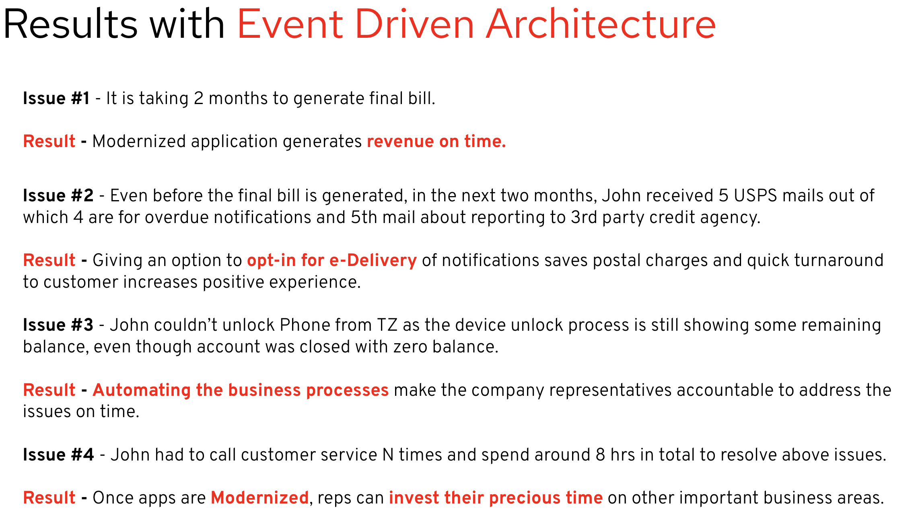

Pre-reqs : 

- **Start MySQL DB** : 

	 	docker run -p 3306:3306 --name=sri-mysql --env="MYSQL_ROOT_PASSWORD=mypassword" mysql
	
	Create below table : 
	    
	    CREATE TABLE account_closed (
	    phoneno varchar(255),
	    unlockphone boolean,
	    phoneunlocked boolean,
	    eDelivery boolean,
	    finalamount varchar(255),
	    finalamountpaid boolean,
	    accountclosed boolean,
	    finalbillnotificationsent boolean,
	    daterequested varchar(255),
	    comments varchar(255));
		

- **Start JBoss with PAM**
	
		CD /Users/svalluru/EAP-7.3.0/bin and Start Jboss EAP standalone.sh -c standalone-full.xml
	
		Go to PAM console : http://localhost:8080/business-central/kie-wb.jsp 
	
- **Start Kafka and HTTP Bridge** (Enable CORS)
	
		Go to /Users/svalluru/Downloads/kafka-bridge-0.19.0/bin 
		
		./kafka_bridge_run.sh --config-file=../config/application.properties

- Clone https://github.com/svalluru/telecom-qos-ui and start using "ng serve" then go to http://localhost:4200/

For Unlock failed scenario : 

	Start PAM task and complete it and check if the DB process is done or not.

**Monitoring the Fuse / Camel**

Add below property in application.properties : 
	
	management.endpoints.web.exposure.include=hawtio,jolokia
	hawtio.authenticationEnabled=false

Add below snippet in pom.xml : 
	
		<dependency>
			<groupId>io.hawt</groupId>
			<artifactId>hawtio-springboot</artifactId>
		</dependency>

**Follow the below steps if you are not using UI to test it.**

Happy Path : 

Put Below JSON message in close-account topic

{
	"phoneno" : "6508621000",
	"unlock" : "false",
	"eDelivery" : "true"
}

Update DB with following statement : 

update account_closed Set finalamountpaid=true where phoneno = '6508621000'

Unlock devide failed Path : 

Put Below JSON message in close-account topic

{
	"phoneno" : "6508621001",
	"unlock" : "true",
	"eDelivery" : "true"
}

Local steps : 
cd /Users/svalluru/kafka_2.13-3.1.0

bin/kafka-server-start.sh config/server.properties
bin/zookeeper-server-start.sh config/zookeeper.properties

Update kafka HTTP bridge port to 8680 and enable cors

./kafka_bridge_run.sh --config-file=../config/application.properties

cd /Users/svalluru/pam712/target/jboss-eap-7.4/bin
./standalone.sh 

podman machine start
podman run -p 3306:3306 --name=sri-mysql --env="MYSQL_ROOT_PASSWORD=mypassword" mysql
create table

in telecom-qos-ui folder
run npx ng serve

Create PAM Admin user with username "rhpamAdmin" as it is used in Process Definition.
Create server and deploy the app in server.

cleanup steps : 

truncate table account_closed
clean messages in Kafka topics

unlock failed number 6508627100

